# SNA Programming Assignment 4\ 
\ 
### Generate Random Graphs:\ 
**Q: 1. Write functions to Generate Random Graph with (i) N nodes and L edges and (ii) N and p parameter. (Do not use lib function)**\ 
The algorithm that was used for this question takes advantage of batch streaming of edge information while generating the graph. If all the edges are stored in the memory at the same time while adding them to the graph, it leads to memory overflow even on platforms like Google Colab. \ 
\ 
The following are the random graphs generated for different values of N from both functions. \ 
N = 10:\ 
Random Gnm Graph with 10 nodes and 10 edges\ 
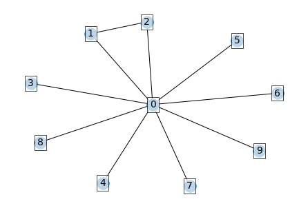 \ 
Random Gnp Graph with 9 nodes and 11 edges \ 
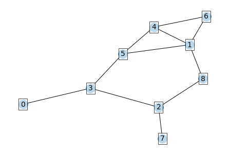\ 
\ 
\ 
N = 50: \ 
Random Gnm Graph with 50 nodes and 150 edges\ 
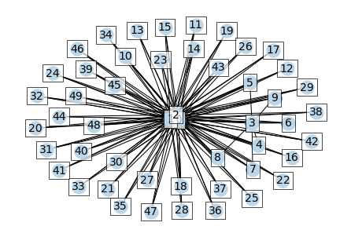 \ 
Random Gnp Graph with 50 nodes and 297 edges\ 
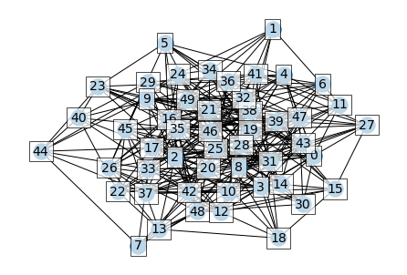\ 
\ 
N=100:\ 
Random Gnm Graph with 100 nodes and 300 edges\ 
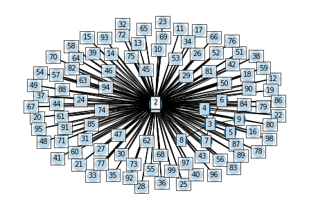 \ 
Random Gnp Graph with 100 nodes and 1231 edges\ 
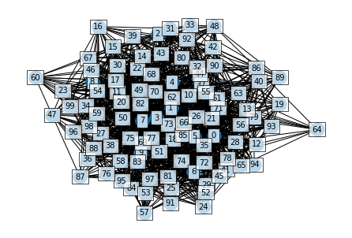\ 
\ 
Details:\ 
The algorithm uses a common function to with an option to keep p static (for $G_{np}$) or keep increasing p to meet L (for $G_{nl}$). \ 
\ 
The maths behind the second case is as follows:\ 
The total edges covered ratio:\ 
$$ T = 1 - \frac{covered}{\frac{N*(N-1)}{2}} $$\ 
\ 
The edges considered to be added to the graph ratio:\ 
$$ E = 1 - \frac{edge\_count}{L} $$\ 
\ 
Dynamically incrementing p:\ 
$$ p = 1 - (T - E) \ge 0$$\ 
i.e. if T - E = 0, then add every edge.\ 
\ 
These equations ensure that the algorithm quickly optimizes adding edges over the batch iterations for $G_{nl}$. The starting probability is 0.5.\ 
\ 
**Evaluation**\ 
Networkx algorithms for random graph generation were used as benchmarks. The `dense_gnm_random_graph` was used for dense graphs and `gnm_random_graph` was used for sparse graphs. The implemented algo `generate_gnl_random` can be used in both cases. \ 
\ 
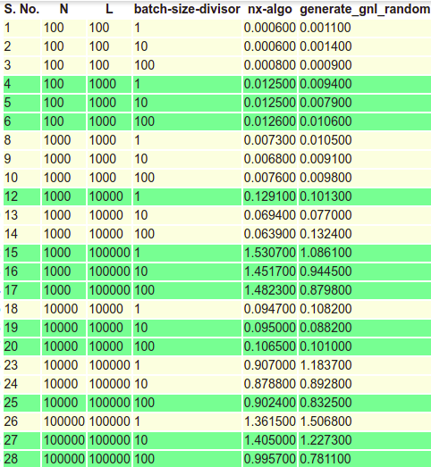\ 
Here batch-size-divisor is the integer used to get batch size. \ 
$batch\_size = \frac{L}{batch-size-divisor}$\ 
\ 
Out of the experimented results for the same values for the set of N, L and batch-size-divisor, the minimum value was chosen.\ 
\ 
Similar evaluation was performed for `generate_gnp_random` with benchmark algorithms taken as `gnp_random_graph` and `fast_gnp_random_graph`. The following results were obtained.\ 
\ 
\ 
For the green values for this algorithm, the `generate_gnp_random` function skips those pairs of N and p that have no edges.\ 
\ 
\ 
**Q: 2. Generate Random Graph (Using any algorithm) and Scale-Free Graph (using Barabasi-Albert model) of different sizes ranging from N=100 to 10^5/10^6 (based on your machine). Plot their degree distributions, both in usual scale and log-log scale.**\ 
\ 
N=100:\ 
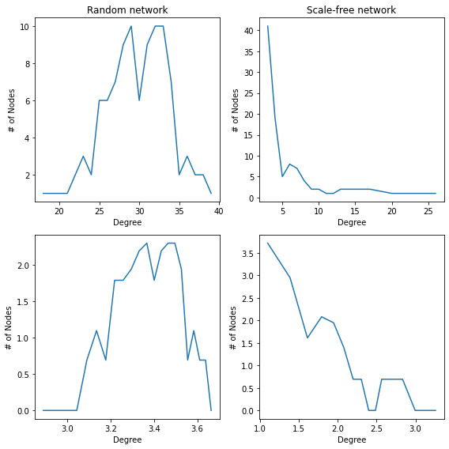\ 
N=500:\ 
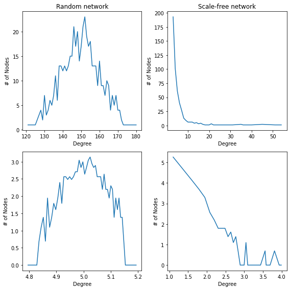\ 
N=1000:\ 
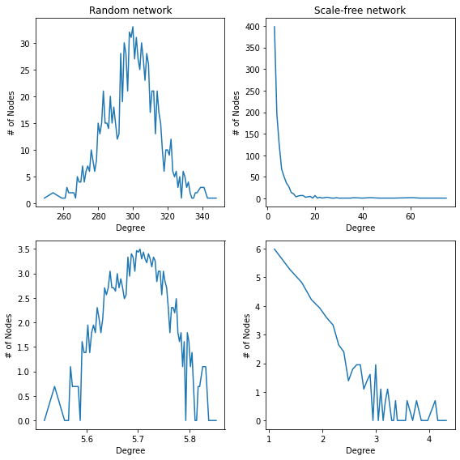\ 
N=5000:\ 
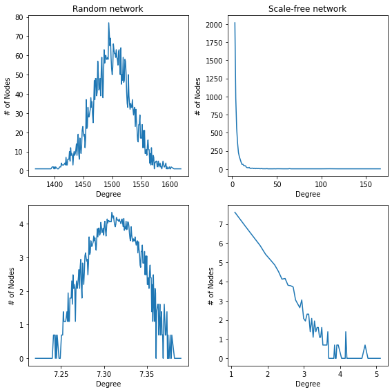\ 
\ 
**Q: 3. Do a structural analysis of a Random Graph and a Scale-Free Graph of moderate size.**\ 
\ 
The structural analysis for random graph of 1000 nodes is as follows:\ 
```\ 
============================== Node Count, Edge Count, Average Degree ==============================\ 
Graph with 100 nodes and 990 edges\ 
Average Degree: 2e+01\ 
```\ 
============================== Degree Distribution ==============================\ 
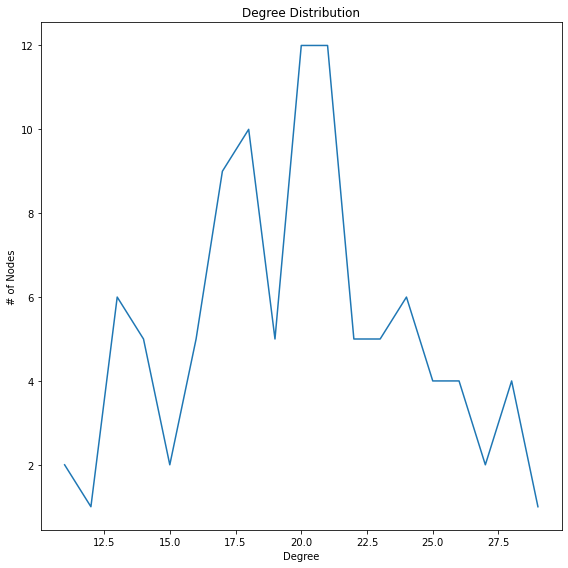\ 
```\ 
============================== Triangles ==============================\ 
The number of triangles at nodes:\ 
 0 :         38 1 :         48 2 :         14 3 :         57 4 :         45\ 
 5 :         57 6 :         27 7 :         32 8 :         40 9 :         23\ 
10 :         4611 :         3612 :         4013 :         3114 :         50\ 
15 :         1516 :         6817 :         1418 :         2519 :         38\ 
The total number of triangles in the graph is  1315.0\ 
\ 
============================== Diameter ==============================\ 
The diameter of the graph is 3\ 
\ 
============================== Connected Components ==============================\ 
Component 1      Length : 100\ 
Total connected components in the graph: 1\ 
Size of largest connected component:  100\ 
\ 
============================== Clustering Coefficient ==============================\ 
The clustering coefficient of node:\ 
 0 : 0.20       1 : 0.17       2 : 0.15       3 : 0.19       4 : 0.21      \ 
 5 : 0.21       6 : 0.18       7 : 0.24       8 : 0.19       9 : 0.19      \ 
10 : 0.22      11 : 0.17      12 : 0.17      13 : 0.23      14 : 0.20      \ 
15 : 0.19      16 : 0.18      17 : 0.18      18 : 0.16      19 : 0.20      \ 
The average clustering coefficient of the graph is 0.20\ 
\ 
============================== Degree Centrality ==============================\ 
 0 : 0.20       1 : 0.24       2 : 0.14       3 : 0.25       4 : 0.21      \ 
 5 : 0.24       6 : 0.18       7 : 0.17       8 : 0.21       9 : 0.16      \ 
10 : 0.21      11 : 0.21      12 : 0.22      13 : 0.17      14 : 0.23      \ 
15 : 0.13      16 : 0.28      17 : 0.13      18 : 0.18      19 : 0.20      \ 
\ 
============================== Closeness Centrality ==============================\ 
 0 : 0.55       1 : 0.57       2 : 0.53       3 : 0.57       4 : 0.56      \ 
 5 : 0.57       6 : 0.55       7 : 0.54       8 : 0.56       9 : 0.54      \ 
10 : 0.55      11 : 0.56      12 : 0.56      13 : 0.54      14 : 0.56      \ 
15 : 0.53      16 : 0.58      17 : 0.52      18 : 0.55      19 : 0.56      \ 
\ 
============================== Betweenness Centrality ==============================\ 
 0 : 0.02       1 : 0.01       2 : 0.00       3 : 0.01       4 : 0.01      \ 
 5 : 0.01       6 : 0.00       7 : 0.00       8 : 0.00       9 : 0.00      \ 
10 : 0.01      11 : 0.01      12 : 0.01      13 : 0.00      14 : 0.01      \ 
15 : 0.00      16 : 0.01      17 : 0.00      18 : 0.00      19 : 0.01      \ 
\ 
============================== Eigenvector Centrality ==============================\ 
 0 : 0.10       1 : 0.12       2 : 0.06       3 : 0.12       4 : 0.10      \ 
 5 : 0.12       6 : 0.09       7 : 0.08       8 : 0.10       9 : 0.08      \ 
10 : 0.10      11 : 0.10      12 : 0.11      13 : 0.09      14 : 0.11      \ 
15 : 0.07      16 : 0.14      17 : 0.06      18 : 0.08      19 : 0.10      \ 
\ 
```\ 
\ 
Structural analysis for scale-free network:\ 
\ 
```\ 
============================== Node Count, Edge Count, Average Degree ==============================\ 
Graph with 100 nodes and 819 edges\ 
Average Degree: 1.6e+01\ 
```\ 
============================== Degree Distribution ==============================\ 
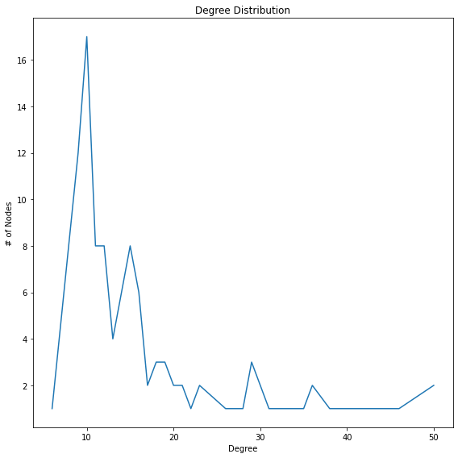\ 
```\ 
============================== Triangles ==============================\ 
The number of triangles at nodes:\ 
 0 :        291 1 :         80 2 :         34 3 :        129 4 :         46\ 
 5 :         24 6 :         55 7 :          6 8 :         67 9 :         56\ 
10 :        25911 :        20512 :        15413 :        16014 :        159\ 
15 :        14016 :        13217 :         8918 :        11119 :        100\ 
The total number of triangles in the graph is  1385.0\ 
\ 
============================== Diameter ==============================\ 
The diameter of the graph is 3\ 
\ 
============================== Connected Components ==============================\ 
Component 1      Length : 100\ 
Total connected components in the graph: 1\ 
Size of largest connected component:  100\ 
\ 
============================== Clustering Coefficient ==============================\ 
The clustering coefficient of node:\ 
 0 : 0.24       1 : 0.23       2 : 0.32       3 : 0.28       4 : 0.34      \ 
 5 : 0.36       6 : 0.36       7 : 0.40       8 : 0.35       9 : 0.27      \ 
10 : 0.21      11 : 0.20      12 : 0.24      13 : 0.27      14 : 0.25      \ 
15 : 0.20      16 : 0.25      17 : 0.27      18 : 0.27      19 : 0.25      \ 
The average clustering coefficient of the graph is 0.26\ 
\ 
============================== Degree Centrality ==============================\ 
 0 : 0.51       1 : 0.27       2 : 0.15       3 : 0.31       4 : 0.17      \ 
 5 : 0.12       6 : 0.18       7 : 0.06       8 : 0.20       9 : 0.21      \ 
10 : 0.51      11 : 0.46      12 : 0.36      13 : 0.35      14 : 0.36      \ 
15 : 0.38      16 : 0.33      17 : 0.26      18 : 0.29      19 : 0.29      \ 
\ 
============================== Closeness Centrality ==============================\ 
 0 : 0.67       1 : 0.58       2 : 0.52       3 : 0.59       4 : 0.54      \ 
 5 : 0.52       6 : 0.55       7 : 0.47       8 : 0.56       9 : 0.55      \ 
10 : 0.67      11 : 0.65      12 : 0.61      13 : 0.61      14 : 0.61      \ 
15 : 0.62      16 : 0.60      17 : 0.57      18 : 0.59      19 : 0.59      \ 
\ 
============================== Betweenness Centrality ==============================\ 
 0 : 0.05       1 : 0.03       2 : 0.01       3 : 0.01       4 : 0.00      \ 
 5 : 0.01       6 : 0.00       7 : 0.00       8 : 0.00       9 : 0.03      \ 
10 : 0.08      11 : 0.10      12 : 0.02      13 : 0.04      14 : 0.03      \ 
15 : 0.06      16 : 0.03      17 : 0.01      18 : 0.01      19 : 0.03      \ 
\ 
============================== Eigenvector Centrality ==============================\ 
 0 : 0.26       1 : 0.14       2 : 0.09       3 : 0.17       4 : 0.11      \ 
 5 : 0.07       6 : 0.11       7 : 0.04       8 : 0.13       9 : 0.12      \ 
10 : 0.25      11 : 0.22      12 : 0.19      13 : 0.19      14 : 0.19      \ 
15 : 0.18      16 : 0.18      17 : 0.14      18 : 0.16      19 : 0.15      \ 
```\ 
\ 
